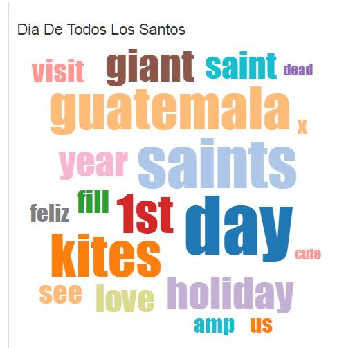

# Describing Google Trends search Querys through related Tweets.
***

### Developed by Juan Bernado Gómez [@juanbert](https://twitter.com/Juanbert) & Michael Ellner [@mikeellner](https://twitter.com/mikeellner)

***

We developed an application capable of describing certain facts from Google Trend search querys (SQ) with information available on tweets. When someone makes google search what they retrieve is a web page rank ordered by google's algorithm, google trends are interesting because they are trending topics on the world public opinion. Meanwhile twitter is a micro-blog and tweets are status update from personal  accounts, therefor Tweets represent a personal opinió. Until now thing new has been said.  


There were three facts we were able to describe with this analysis: 
1. Timeline of the content generation on twitter and the amount of impressions on google search related to the google trends.
2. Opinion analysis through natural language processing.
3. Location of the people behind the twitter accounts that generate related content.  


# Behind the scenes

## 1-> ETL

We built an ETL (extract-transform-load) process to obtain the data needed and provide the data access services for the different analysis functionalities.  The application is based on unstructured data, that made us use a Mongodb which is a document database. All the data was managed in json format.


###1. Extraction; 

* Google Trends: using web scraping to obtain the SQ from the google  trends web page (www.google.com/trends/) from four different countries where the service is available (Mexico, United States, Great Britain, Spain) and two different languages (Spanish and English).

* Twitter: the search querys from google trend were passed to as search querys using the twitter api looking to retrieve related tweets on the matter.

###2. Transformation; 

* Google trends; information had to be completed for the SQ with date of extraction and country of origin.
	
* Twitter; all the field available through the API response were retrieved and no transformation was made.

###3. Load; 
As said befor, we worked with object oriented elements in json format and the elements were loaded to a Mongo database using a python script. Creating two tables, google trends and tweets. 

->Example of google trend element:

```python
db.google_hottrends.find_one()
```

```javascript
{u'_id': ObjectId('580f771d9bb0062a76e06d3f'),
 u'dateTime': datetime.datetime(2016, 10, 25, 17, 15, 41),
 u'formated_time': u'Tue_Oct_25_17_15_41_2016',
 u'geo': u'ES',
 u'qs': [u'Praga',
  u'Copa del Rey',
  u'Antoni Van Leeuwenhoek',
  u'Pete Burns',
  u'France Football',
  u'Fox',
  u'FastPokeMap',
  u'Los Otros Dos',
  u'San Rafael']}

```

->Example of a tweet:


```python
db.tweets.find_one()
```

```javascript
{u'_id': '790720412531433472L',
 u'contributors': None,
 u'coordinates': None,
 u'created_at': u'Tue Oct 25 01:03:31 +0000 2016',
 u'dateTime': datetime.datetime(2016, 10, 25, 1, 3, 31),
 u'entities': {u'hashtags': [],
  u'symbols': [],
  u'urls': [],
  u'user_mentions': []},
 u'favorite_count': 1,
 u'favorited': False,
 u'geo': None,
 u'id_str': u'790720412531433472',
 u'in_reply_to_screen_name': None}
```

This process runs __live__; extracts, transforms and loads the data all the time maintaining the information actualized. There is a restrictions with the twitter API related to the amount of tweets an account is able to retrieve, 1800 tweets every 15 minutes. 


## 2-> Information extractión for analysis 

##### We have two types of analysis, using structured and unstructured data. 


### 1. Structured Data:

* Timeline: 
1. Google Trend SQ historical impressions 
2. Count of Tweets created every hour for a determined search query: This was made through a group by
date-query and count operation. The represented in a D3.js time graphic.
 
### 2. Unstructured Data:

* **__Natural Language processing:__** The analysis consisted in a word count,  for every recent tweet related to a selected SQ. Then this word count was plotted in a word cloud were the size of the word depends on the frequency of a word.
A series of transformations to the text were made before making the word count.

* Filtering stops words, the most common words in a language, that don't add any value to the analysis.
* Filtering the SQ, obviously the words contained in it will appear more than one time and we are looking for what people say about a determined Google Trend.
* Filtering URL, hipper links any other character that doesn't mean anything for the human language in Spanish or English. 



* **__Geographically locating the tweet:__** behind a tweet there is a user account and most of the accounts have the tweet coordinates blocked but there is a field called “location” where users write their location. This location is written by humans in many different ways. 

		*For example: __New York__
			..*New York City,
			..*New York City, US
			..*The Big Apple
			..*Nueva York

So the only way to associate a tuple of coordinate to this kind of information was through mapping any possible name combination for a city using a data set that already the possible values.      
		
__This is an overview of the logic behind the algorithms used to make the analysis, for deeper understanding of them we recommend to dive into the scripts that make the work.__


## 3-> Visualising  


There are two tools used to visualise the results.

1. __Jupyter notebooks:__ Number 1 tool for Data Science working in python. We show code and plots related to the analysis.     

1. __Web Page ()__ that uses various set of tools available to develop a web applications with analytical capabilities. This are: 

* __Flask:__ for the backend of the web page to deliver services for the html and javascript. Values shown in the frontend are retrieved from here as well there is an API to feed the D3.js objects 
* __D3.js:__ to build beautiful and interactive graphics
* __JavaScript (jQuery):__ To enable user interaction with the web page.
* __DataMaps:__ To draw maps of the locations of the tweets 
* __Bootstrap:__ Nice UX and responsive html 


